# Welcome to NCU Saga Wiki!

The **NCU Saga** is a massive, original fantasy story told by several modern Nintendocore bands across many releases.

## NCU Saga Releases
| | | | 
| -------------------------------------------------------------------------------------------------------------------------------------- | -------------------------------------------------------------------------------------------------------------------------- | ------------------------------------------------------------------------------ |
| 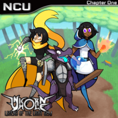 [Legend of the Light Gem](Legend_of_the_Light_Gem) | 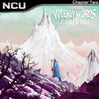 [Twenty Years of Snow](Twenty_Years_of_Snow) | 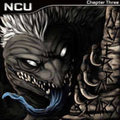 [Scars](Scars)                 |
| 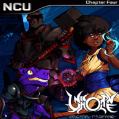 [Arcana Profane](Arcana_Profane)                                     | 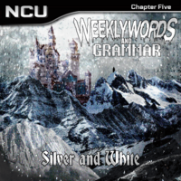 [Silver and White](Silver_and_White)                 | 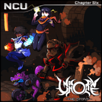 [The Storm](The_Storm) |
| 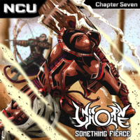 [Something Fierce](Something_Fierce)                             |                                                                                                                            |                                                                                |

## NCU Saga Main Characters

| | | | 
| ------------------------------------------------------------------ | -------------------------------------------------------------- | -------------------------------------------------------------- |
| 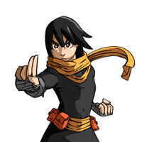 [Astrid](Astrid) | 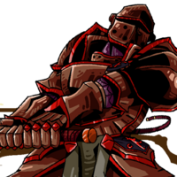 [Garth](Garth) | 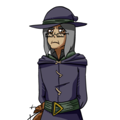 [Ghael](Ghael) |
| 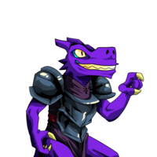 [Grub](Grub)         | 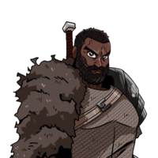 [Isaac](Isaac) | 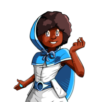 [Kat](Kat)         |
| 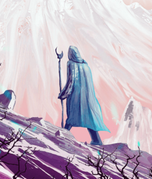 [Nick](Nick)                 | 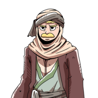 [Sloan](Sloan) | 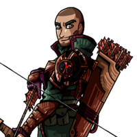 [Wade](Wade)       |

## NCU Saga Artists

| | | | 
| ------------------------------------------------------------------------------------------------- | ------------------------------------------------------------- | ---------------------------------------------------------------------------------------------------------------- |
| 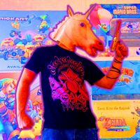 [Unicorn Hole](Unicorn_Hole)                   |  [Nuerra](Nuerra) | 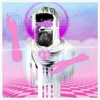 [Weekly Words and Grammar](Weekly_Words_and_Grammar) |
| 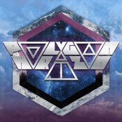 [Polygon Horizon](Polygon_Horizon) |                                                               |                                                                                                                  |

## External Links and Resources

### Official Sites

- Official Artists websites:
  - [Unicornhole bandcamp](https://unicornhole.bandcamp.com/)
  - [Weekly Words and Grammar](https://weeklywordsandgrammar.com/music)
  - [Nuerra bandcamp](https://nuerra.bandcamp.com/)
  - [Weekly Words and Grammar SoundCloud](https://soundcloud.com/weeklywordsandgrammar)
  - [Weekly Words And Grammar Spotify](https://open.spotify.com/artist/5PnssyKmdFnswZr6i4xJjm?si=YPiCWhvhQmO2zbzv-Dt3Cg&nd=1)
  - [Nuerra Spotify](https://open.spotify.com/artist/68s32IhXyvBO3G9sTd5bTP?si=mnVSHyb-QuGCFvJbFMvDjg&nd=1)

### Official Social Media

- Unicorn Hole:
  - .png) [facebook.com/unicornhole](https://www.facebook.com/unicornhole)
  -  [instagram.com/uholeband/](https://www.instagram.com/uholeband/)
  - .png) [youtube.com/c/unicornhole64](https://www.youtube.com/c/unicornhole64)
  -  [patreon.com/unicornhole](https://www.patreon.com/unicornhole)
- Weekly Words and Grammar:
  - .png) [facebook.com/weeklywordsandgrammar](https://www.facebook.com/weeklywordsandgrammar)
  - .png) [twitter.com/WWGband](https://twitter.com/WWGband)
  -  [blog.weeklywordsandgrammar.com](https://blog.weeklywordsandgrammar.com/)

## NCU Saga Navigation

| NCU Saga |  |
|---|---|
| Characters | **Main**: [Kat](Kat) • [Astrid](Astrid) • [Grub](Grub) • [Ghael](Ghael) • [Garth](Garth) • [Wade](Wade) • [Nick](Nick) • [Isaac](Isaac) • [Sloan](Sloan) |
|  | **Secondary**: [Larv](Larv) • [Phoebe](Phoebe) • [Riza](Riza) • [Ellie](Ellie) • [Ghenim](Ghenim) |
|  | **Other**: [Ulric](Ulric) • [The Shifting Sands](The_Shifting_Sands) • [Silver](Silver) • [Nora](Nora) • [Shina](Shina) • [White Robe](White_Robe) • [Bandit Crew](Bandit_Crew) |
| Kingdom of Elluryah | **Cities**: [Bristol](Bristol) • [Shinrin](Shinrin) • [Boraea](Boraea) • [Eredet](Eredet) • [Letchim](Letchim) |
|  | **Locations**: [Forsyth Forest](Forsyth_Forest) • [Kharusurahk Desert](Kharusurahk_Desert) • [Mistral Mountains](Mistral_Mountains) • [The Mines](The_Mines) • [The Wailing Coast](The_Wailing_Coast) |
| Music | **Albums**: [Legend of the Light Gem](Legend_of_the_Light_Gem) • [Twenty Years of Snow](Twenty_Years_of_Snow) • [Scars](Scars) • [Arcana Profane](Arcana_Profane) • [Silver and White](Silver_and_White) • [The Storm](The_Storm) • [Something Fierce](Something_Fierce) |
|  | **Artists**: [Unicorn Hole](Unicorn_Hole) • [Nuerra](Nuerra) • [Weekly Words and Grammar](Weekly_Words_and_Grammar) • [Polygon Horizon](Polygon_Horizon) |
